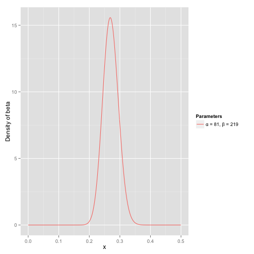
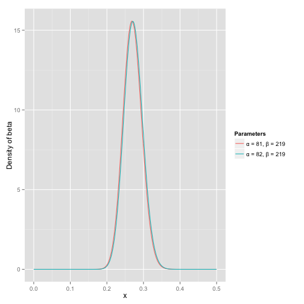
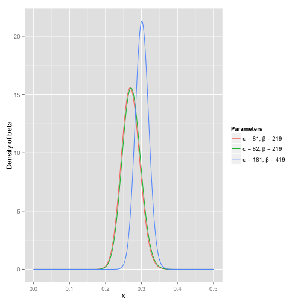

## what

* 用一句话来说，beta分布可以看作一个概率的概率分布，当你不知道一个东西的具体概率是多少时，它可以给出了所有概率出现的可能性大小。

## who (谁受影响)

* 举一个简单的例子，熟悉棒球运动的都知道有一个指标就是棒球击球率(batting average)，就是用一个运动员击中的球数除以击球的总数，我们一般认为0.266是正常水平的击球率，而如果击球率高达0.3就被认为是非常优秀的。
* 现在有一个棒球运动员，我们希望能够预测他在这一赛季中的棒球击球率是多少。你可能就会直接计算棒球击球率，用击中的数除以击球数，但是如果这个棒球运动员只打了一次，而且还命中了，那么他就击球率就是100%了，这显然是不合理的，因为根据棒球的历史信息，我们知道这个击球率应该是0.215到0.36之间才对啊。
* 对于这个问题，我们可以用一个二项分布表示（一系列成功或失败），一个最好的方法来表示这些经验（在统计中称为先验信息）就是用beta分布，这表示在我们没有看到这个运动员打球之前，我们就有了一个大概的范围。beta分布的定义域是(0,1)这就跟概率的范围是一样的。
* 接下来我们将这些先验信息转换为beta分布的参数，我们知道一个击球率应该是平均0.27左右，而他的范围是0.21到0.35，那么根据这个信息，我们可以取α=81,β=219

之所以取这两个参数是因为：

- beta分布的均值是
- 从图中可以看到这个分布主要落在了(0.2,0.35)间，这是从经验中得出的合理的范围。

在这个例子里，我们的x轴就表示各个击球率的取值，x对应的y值就是这个击球率所对应的概率。也就是说beta分布可以看作一个概率的概率分布。

那么有了先验信息后，现在我们考虑一个运动员只打一次球，那么他现在的数据就是”1中;1击”。这时候我们就可以更新我们的分布了，让这个曲线做一些移动去适应我们的新信息。**beta分布在数学上就给我们提供了这一性质，他与二项分布是共轭先验的（[Conjugate_prior](https://link.zhihu.com/?target=https%3A//en.wikipedia.org/wiki/Conjugate_prior%23Example)）。所谓共轭先验就是先验分布是beta分布，而后验分布同样是beta分布。**结果很简单： 

其中α0和β0是一开始的参数，在这里是81和219。所以在这一例子里，α增加了1(击中了一次)。β没有增加(没有漏球)。这就是我们的新的beta分布Beta(81+1,219)，我们跟原来的比较一下：

可以看到这个分布其实没多大变化，这是因为只打了1次球并不能说明什么问题。但是如果我们得到了更多的数据，假设一共打了300次，其中击中了100次，200次没击中，那么这一新分布就是： 

注意到这个曲线变得更加尖，并且平移到了一个右边的位置，表示比平均水平要高。

一个有趣的事情是，根据这个新的beta分布，我们可以得出他的数学期望为：，这一结果要比直接的估计要小  。你可能已经意识到，我们事实上就是在这个运动员在击球之前可以理解为他已经成功了81次，失败了219次这样一个先验信息。

>  对于一个我们不知道概率是什么，而又有一些合理的猜测时，beta分布能很好的作为一个表示概率的概率分布。

## where (性质有哪些)

### beta分布与二项分布的共轭先验性质二项分布

* 二项分布即重复n次独立的伯努利试验。在每次试验中只有两种可能的结果，而且两种结果发生与否互相对立，并且相互独立，与其它各次试验结果无关，事件发生与否的概率在每一次独立试验中都保持不变，则这一系列试验总称为n重伯努利实验，当试验次数为1时，二项分布服从0-1分布

#### 二项分布的似然函数：

beta分布

在beta分布中，B函数是一个标准化函数，它只是为了使得这个分布的概率密度积分等于1才加上的。

#### 贝叶斯估计

我们做贝叶斯估计的目的就是要在给定数据的情况下求出θ的值，所以我们的目的是求解如下后验概率： 

注意到因为P(data)与我们所需要估计的θ是独立的，因此我们可以不考虑它。

我们称P(data|θ)为似然函数，P(θ)为先验分布

### 共轭先验

现在我们有了二项分布的似然函数和beta分布，现在我们将beta分布代进贝叶斯估计中的P(θ)中，将二项分布的似然函数代入P(data|θ)中，可以得到： 

我们设a′=a+z,b′=b+N−z 
最后我们发现这个贝叶斯估计服从Beta(a’,b’)分布的，我们只要用B函数将它标准化就得到我们的后验概率： 

参考资料：

1. [Understanding the beta distribution (using baseball statistics)](https://link.zhihu.com/?target=http%3A//varianceexplained.org/statistics/beta_distribution_and_baseball/)
2. [20 - Beta conjugate prior to Binomial and Bernoulli likelihoods](https://link.zhihu.com/?target=https%3A//www.youtube.com/watch%3Fv%3DhKYvZF9wXkk)

3. [如何通俗理解 beta 分布？](https://www.zhihu.com/question/30269898)