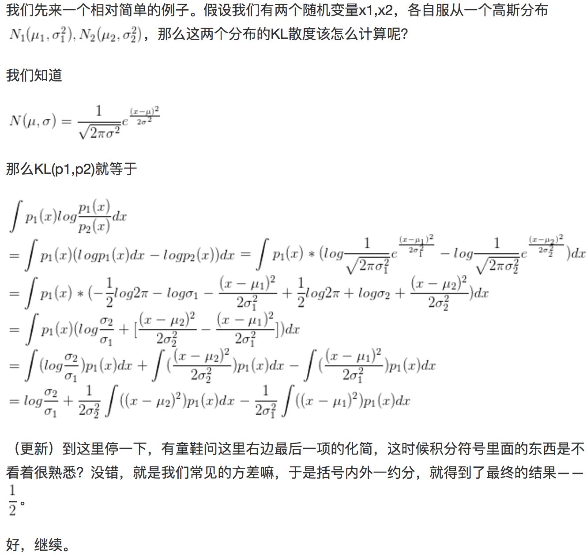
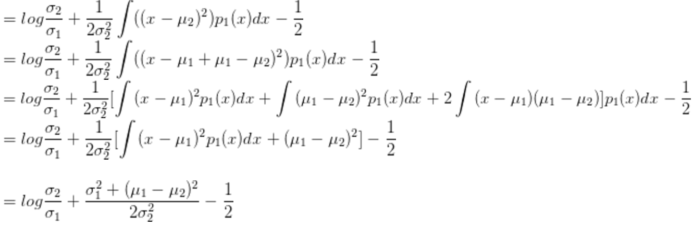
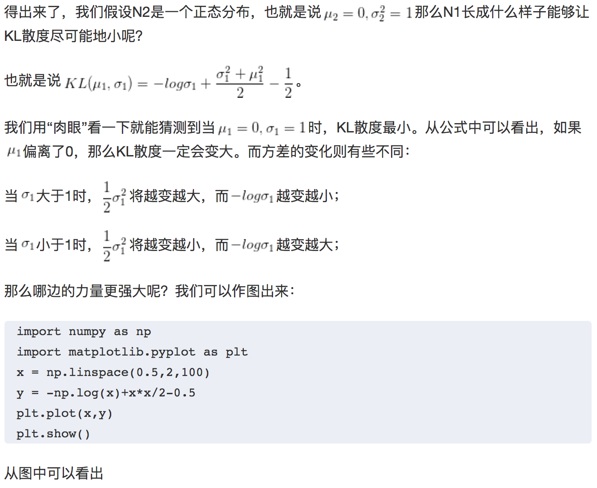
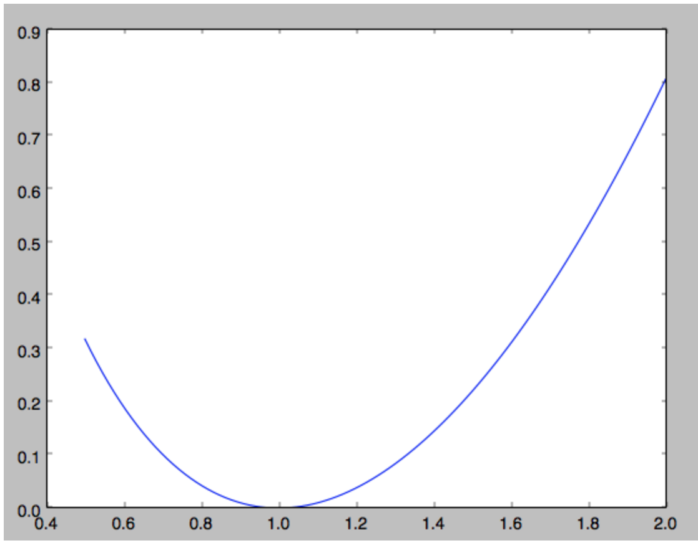
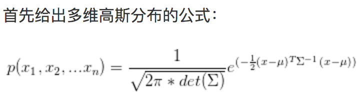
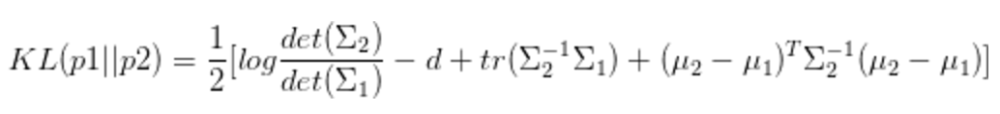

*  DKL(q||p)  KL散度度量从候选概率p获得信息匹配某个“ground truth” q. （找到一个p，让它模仿q）
* KL散度不对称 — DKL(q||p)≠DKL(p||q)

* [KL散度通俗理解](https://www.jianshu.com/p/43318a3dc715)

* KL散度是度量两个分布之间差异的函数。在各种变分方法中，都有它的身影。

* 一维高斯分布的KL散度

* 多维高斯分布的KL散度：

* KL散度公式为：

* 无论从概率论的角度，还是从信息论的角度，我们都可以很好地给出KL散度测量的意义。
这里不是基础的概念介绍，所以有关KL的概念就不介绍了。在Variational Inference中，我们希望能够找到一个相对简单好算的概率分布q，
使它尽可能地近似我们待分析的后验概率p(z|x)，其中z是隐变量，x是显变量。在这里我们的“loss函数”就是KL散度，
他可以很好地测量两个概率分布之间的距离。如果两个分布越接近，那么KL散度越小，如果越远，KL散度就会越大。

> 从 N（u, sd）采样和从 N(0, 1)采用数据 然后 (data * sd + u)运算得到数据是一样的。

### 参考文献
* [变分自编码-KL散度](https://zhuanlan.zhihu.com/p/22464760)